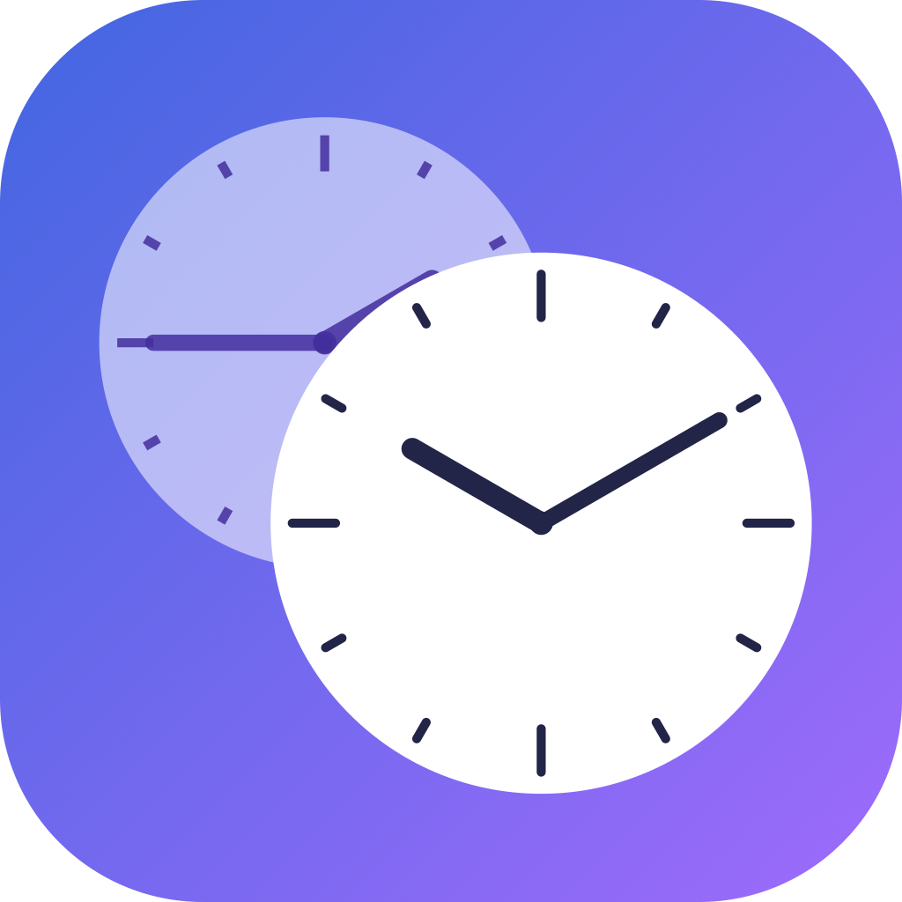
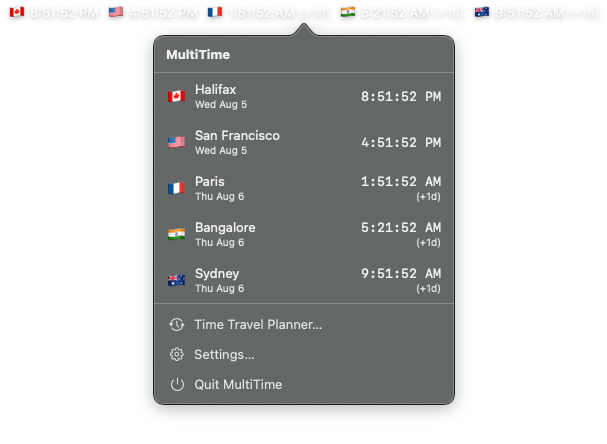
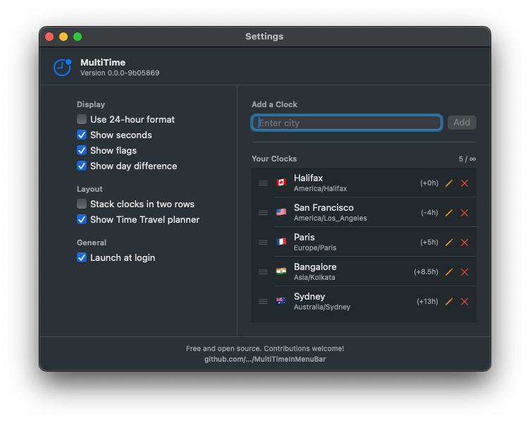
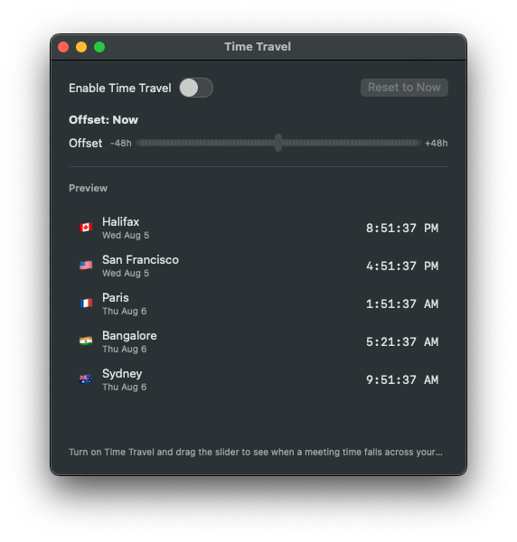

<p align="center">
  
</p>

<h1 align="center">MultiTime</h1>

<p align="center">
  <b>Every time zone in your macOS menu bar.<br/>
  Free. Open source. Every feature unlocked, forever.</b>
</p>

<p align="center">
  <a href="LICENSE"></a>
  
  
  
  <a href="https://github.com/Ferin79/MultiTimeBar/releases/latest"></a>
  <a href="../../actions/workflows/ci.yml"></a>
</p>

<p align="center">
  <a href="../../releases/latest"><b>⬇️ Download the latest DMG</b></a>
  &nbsp;·&nbsp;
  <a href="#quick-start">Quick start</a>
  &nbsp;·&nbsp;
  <a href="#features">Features</a>
  &nbsp;·&nbsp;
  <a href="#vs-paid-alternatives">Comparison</a>
  &nbsp;·&nbsp;
  <a href="#faq">FAQ</a>
</p>

<p align="center">
  <i>The free, open source alternative to <b>MultiTime — Menu Bar Time Zones</b>,
  world clock menu bar apps, and every other paywalled multi-timezone tool for Mac.</i>
</p>

---

## Why MultiTime?

If you work with a distributed team, coordinate with family abroad, watch global markets, or plan cross-continental meetings, you already know the pain:

- You do time-zone math in your head at 11pm.
- You accidentally book a meeting for 3am Seoul.
- You call your parents on the wrong day.

Every menu bar clock app on the Mac App Store either **charges a monthly subscription for basics** or **locks the useful features (multiple clocks, meeting planner, layout options) behind a "Pro" paywall**.

**MultiTime does all of it for free, forever, and never phones home.** No sign-in. No trial. No "upgrade to Pro" nag. No analytics. No ads. No dark patterns. Just a fast, native SwiftUI app that lives in your menu bar and works exactly the way you'd expect.

## Features

Everything is free. Everything is unlocked. Everything is on-device.

- 🌍 **Unlimited clocks** — Add as many time zones as you like. Two, ten, fifty — no cap.
- 🇰🇷 **Country flag emojis** — Recognize a time zone at a glance without reading the letters.
- ⏰ **12 or 24-hour format** — With optional seconds and instant switching.
- 📆 **Day difference indicators** — `(+1d)` or `(-1d)` so you never book Monday for someone's Sunday night.
- 🧱 **Stack clocks in two rows** — Fit 6+ clocks on a notched MacBook without eating your menu bar. (Yes, this is a *free* feature.)
- 🕐 **Time Travel planner** — Drag a slider to see when a proposed meeting time lands in every zone at once. Perfect for scheduling across three continents.
- 🔍 **150+ cities searchable** — Type "sing", hit Enter, done. All backed by the IANA `tz` database.
- ↕️ **Reorder, rename, remove** — Drag to reorder in Settings, pencil to rename, red X to delete.
- 🚀 **Launch at login** — Native `SMAppService` integration (macOS 13+), on by default.
- 🖤 **Dark mode and light mode** — Automatically follows your system appearance.
- 🔒 **Zero telemetry** — MultiTime does not make a single network request. Ever. Verified in [PRIVACY.md](PRIVACY.md).
- 🧾 **Open source (MIT)** — Read the code. Fork the code. Ship your own build.
- 🍎 **100% native Swift + SwiftUI** — Fast. Small. Idiomatic. No Electron.

## Screenshots

<p align="center">
  
</p>

<p align="center">
  <em>The menu bar strip: country flags, live times, and day-difference indicators.</em>
</p>

<p align="center">
  
</p>

<p align="center">
  <em>Click the menu bar strip to open the popover — full details for every clock, plus quick links to Time Travel, Settings, and Quit.</em>
</p>

<p align="center">
  
</p>

<p align="center">
  <em>Settings: toggle display options on the left, add and reorder clocks on the right.</em>
</p>

<p align="center">
  
</p>

<p align="center">
  <em>Time Travel planner: drag the slider to preview a meeting time across every clock.</em>
</p>

## Quick start

**1. Download the DMG**

Grab the latest release from the [Releases page](../../releases/latest) and open the `.dmg`.

**2. Drag `MultiTime.app` to your Applications folder**

**3. Launch it**

The clock strip appears in your menu bar instantly. Click it to open the popover; click **Settings…** to add your first city.

> **First launch tip:** because we don't require users to pay for Apple's notarization ($99/yr), macOS will show a "cannot verify" warning the first time. Right-click `MultiTime.app` in Applications → **Open** → **Open**. macOS remembers the choice. That's it — one-time. Or, in Terminal: `xattr -dr com.apple.quarantine /Applications/MultiTime.app`.

## vs. paid alternatives

| Feature | **MultiTime** (this app) | MultiTime — Menu Bar Time Zones | Other paid menu bar clocks |
|---|---|---|---|
| Multiple time zones | ✅ **Unlimited** | 🔒 1 free, more paid | 🔒 Usually paywalled |
| Country flags | ✅ Free | ✅ | 🔒 Often paid |
| Day difference (`+1d`) | ✅ Free | ✅ | 🔒 Sometimes paid |
| Stack in two rows | ✅ Free | 🔒 Pro feature | 🔒 Pro feature |
| Time Travel planner | ✅ Free | 🔒 Pro feature | 🔒 Pro feature |
| 24-hour format | ✅ Free | ✅ | ✅ |
| Launch at login | ✅ Free | ✅ | ✅ |
| Zero telemetry / no analytics | ✅ Verifiable | ❓ | ❓ |
| Zero network requests | ✅ Verifiable | ❓ | ❓ |
| Runs on Intel *and* Apple Silicon | ✅ Universal 2 | ✅ | ✅ |
| Open source | ✅ MIT | ❌ | ❌ |
| Subscription | **None** | Monthly/yearly | Monthly/yearly |
| Price | **$0 forever** | Free tier + paid | $$$ |

## Requirements

- **macOS 13 Ventura** or newer (works on Ventura, Sonoma, Sequoia, and up).
- Apple Silicon (M1, M2, M3, M4) or Intel — a Universal 2 build ships in every release.
- ~5 MB of disk. It's a menu bar app.

## Install

### Recommended: DMG from GitHub Releases

1. Download `MultiTime-<version>.dmg` from the [latest release](../../releases/latest).
2. Open the DMG, drag `MultiTime.app` into `/Applications`.
3. Right-click `MultiTime.app` → **Open** the first time (see the [first-launch note above](#quick-start)).

### Build from source

MultiTime is a Swift Package. You have three options:

**a) One command**

```sh
git clone https://github.com/Ferin79/MultiTimeBar.git
cd MultiTimeBar
./scripts/build-app.sh --run
```

That's it — a signed `.app` bundle is written to `build/MultiTime.app` and launched.

**b) Open in Xcode**

```sh
open Package.swift
```

Xcode 15+ opens `Package.swift` natively. Pick the `MultiTime` scheme and press ⌘R.

**c) Plain SwiftPM**

```sh
swift run -c release MultiTime
```

Useful for quick iteration; note that this runs the raw executable (not a `.app` bundle), so `SMAppService` and code-signing features will be limited.

## Privacy

MultiTime does **not**:

- Make network requests.
- Collect analytics, crash reports, or usage data.
- Contact any server operated by us or by a third party.
- Include any advertising or tracking SDKs.

MultiTime **does**:

- Store the clocks you add and the settings you configure in the standard `UserDefaults` container for the app, on your Mac only.

Read the full policy in [PRIVACY.md](PRIVACY.md). Or don't take our word for it — read the source, `grep` for `URLSession`, and see for yourself. There is no network code in this repository.

## Under the hood

Native SwiftUI throughout, built for macOS 13+. A few implementation highlights:

- **`NSStatusItem` + `NSHostingView`** for the menu bar item so the SwiftUI clock strip renders reliably on every Mac (including notched MacBooks) — SwiftUI's `MenuBarExtra` has known display quirks in unbundled SwiftPM executables.
- **`TimelineView(.periodic)`** drives per-second updates without a manual `Timer`.
- **`SMAppService.mainApp`** handles Launch at Login on macOS 13+ — no legacy helper-tool workarounds.
- **`UserDefaults` + `Codable`** for storage. Zero external dependencies. Small binary, fast launch.

Full project layout in [APP_STORE.md](APP_STORE.md#project-layout) and inline in [Sources/MultiTime](Sources/MultiTime).

## Distribution & CI

Every push of a `v*` git tag triggers [.github/workflows/release.yml](.github/workflows/release.yml), which:

1. Builds the `.app` on `macos-14`.
2. Signs it (Developer ID + Apple notarization when the six signing secrets are configured, ad-hoc otherwise).
3. Packages `MultiTime-<version>.dmg` via [scripts/build-dmg.sh](scripts/build-dmg.sh), including a "First-launch instructions.txt" so first-time users aren't confused by Gatekeeper.
4. Publishes a GitHub Release with the DMG and a SHA-256 checksum attached.

```sh
git tag v1.0.0 && git push origin v1.0.0
```

Full Mac App Store submission checklist — icon generation, sandbox entitlements, App Store Connect metadata, `xcrun altool` upload — is in [APP_STORE.md](APP_STORE.md).

## Roadmap

Contributions welcome — pick one and open a PR.

- [ ] iCloud/Handoff sync of clock list across Macs
- [ ] Global hotkey to summon the popover
- [ ] Sunrise/sunset overlay inside each clock row
- [ ] Import from macOS Clock app / iCal
- [ ] Optional dot-menu style (`MenuBarExtra(.menu)`) for users who prefer a native menu
- [ ] Localizations (see the growing list of city entries in `TimezoneDatabase.swift`)

## Contributing

MultiTime is a community project.

1. Fork the repo.
2. `./scripts/build-app.sh --run` to make sure the app builds cleanly on your Mac.
3. Make your change. Keep it small. Match the existing SwiftUI style. Prefer stdlib and platform APIs over new dependencies.
4. Open a PR describing the change and what you tested.

Bug reports and feature ideas: use the [Issues tab](../../issues).

## FAQ

### Is MultiTime really free? Are you going to add a paywall later?

Yes. And no. Every feature is free forever, with no in-app purchase, no subscription, no upgrade prompts. The MIT license makes that legally binding — even if this repository stopped being maintained tomorrow, existing users would still have a permanent free copy, and anyone could fork it.

### How is MultiTime different from paid menu bar time zone apps like *MultiTime — Menu Bar Time Zones*?

MultiTime is a **completely free, open source alternative** to paid multi-timezone menu bar apps. Features that are typically "Pro" (like stacking clocks in two rows and the Time Travel meeting planner) are unlocked from the start. There is no free/paid tier — everything is included.

### Does MultiTime collect any personal data or telemetry?

No. Zero. There is no network code in the app. Read [PRIVACY.md](PRIVACY.md), then verify by inspecting the source.

### Which Macs does MultiTime support?

Any Mac running macOS 13 Ventura or later — Ventura, Sonoma, Sequoia, and newer. Universal 2 binary, so it runs natively on both Apple Silicon (M1, M2, M3, M4) and Intel Macs.

### How many time zones / clocks can I add?

Unlimited. Add one, add fifty. The menu bar strip scrolls out of view once you run out of horizontal space; use the "Stack in two rows" toggle in Settings to double your capacity on notched MacBooks.

### Can MultiTime help me schedule meetings across time zones?

Yes — that's exactly what the **Time Travel Planner** is for. Open the planner from the menu bar popover, enable "Time Travel", and drag the slider. Every clock in your list updates in real time so you can see when a proposed meeting time falls in Seoul, San Francisco, Paris, and everywhere else at once.

### What time zones and cities are supported?

MultiTime ships with ~150 major cities across every continent, mapped to the standard IANA time zone database. Anything with an IANA identifier (like `Europe/Berlin` or `Pacific/Auckland`) works. Missing your city? Open an issue or add a line to `Sources/MultiTime/Models/TimezoneDatabase.swift`.

### Does daylight saving time work correctly?

Yes. MultiTime uses Foundation's `TimeZone` and `Calendar`, which are backed by the OS's IANA `tz` database. DST transitions are handled automatically — including in edge cases like Australian summer time and the various one-off shifts.

### Why does macOS show "Apple could not verify MultiTime is free of malware" on first launch?

Because notarization requires a paid Apple Developer subscription. MultiTime is free open source software; we don't want to force everyone to pay $99/yr just so you can double-click. Bypass the warning once (right-click → Open, or `xattr -dr com.apple.quarantine /Applications/MultiTime.app`) and macOS remembers your choice. If you'd like to remove the warning permanently, fork the repo, add the six signing secrets described in the release workflow, and ship your own notarized build.

### Can I use this at work?

Yes — MIT license. Commercial, corporate, personal, whatever. Use it, ship it, embed it in other projects, resell it. Attribution is appreciated but not required beyond keeping the LICENSE file.

### Where do I file bugs?

[Open an issue](../../issues). Include your macOS version, your Mac architecture (Apple Silicon or Intel), and a short reproduction.

## License

[MIT](LICENSE). Copyright © 2026 MultiTime contributors.

Do whatever you want with it. Attribution appreciated but not required.

---

<p align="center">
  <em>Built by the open source community. If MultiTime saves you from booking a 3am meeting, <a href="../../">star the repo</a> so more people can find it.</em>
</p>

<!--
Keywords for search engines (people looking for us):
  free multi timezone menu bar app for mac
  open source world clock macOS
  multitime menu bar time zones alternative
  free alternative to multitime pro
  menu bar time zone app free
  macos world clock menu bar
  multiple time zones mac menu bar
  time zone tracker mac open source
  meeting planner mac free
  distributed team world clock mac
  swiftui menu bar world clock
  mac menu bar clock multiple time zones free
  best free world clock for mac
-->
